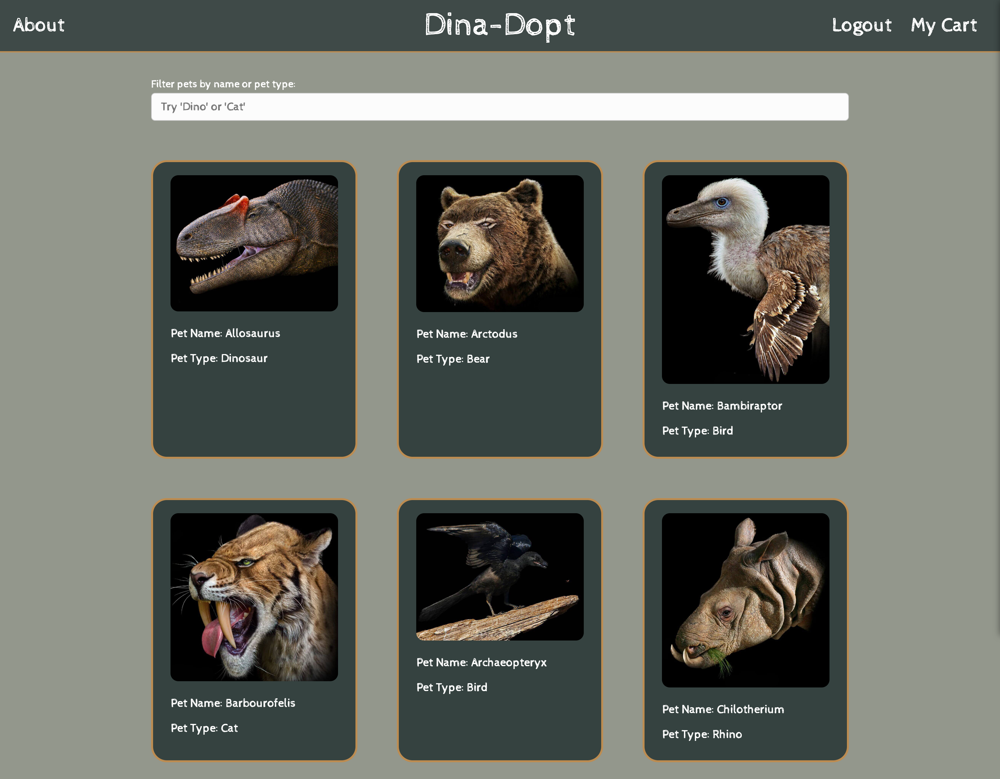
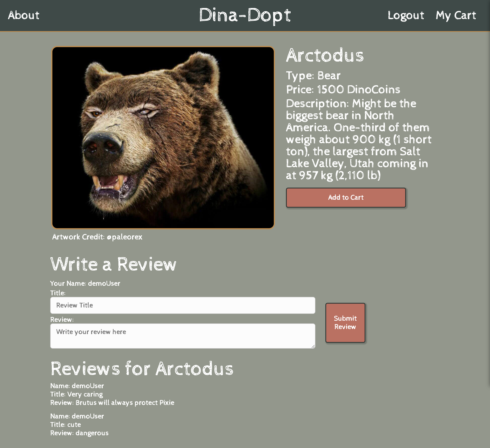
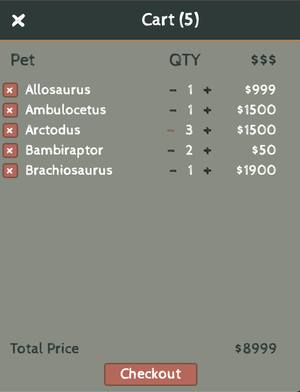
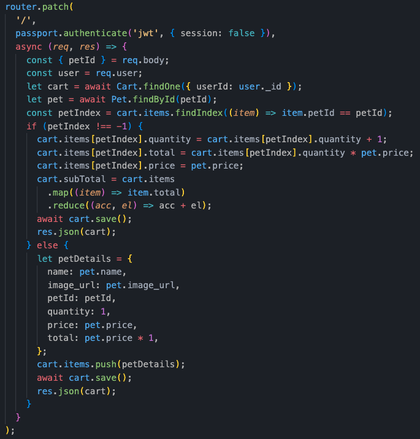

# Dina-Dopt
Check out the live app [here.](https://dina-dopt.herokuapp.com/) \
For design documentation, see wiki [here.](https://github.com/vera-ho/dina-dopt/wiki)

## Introduction
Dina-Dopt is a MERN stack web application that allows users to adopt and review prehistoric pets. It is created for educational purposes only. Please do not enter any sensitive data while exploring Dina-Dopt.

More information for each feature can be found below.

## Users
Users are able to register for an account, login, and logout as needed on the website. The user authentication on the backend uses Express with BCrypt to secure password information. When the user goes to the root directory of the web application, there will be an option to log in along with a demo user log in option.

Users may also click on "Signup" to register a new account.

Both login and signup forms will report any errors if the form does not receive the correct information.

## Technologies Used
* Frontend: `React and Redux`
    - `react-redux`
    - `redux-thunk`
    - `react hooks`
* Backend: `Express`
    - `bcryptjs` - user authentication
    - `passportjs`
    - `jsonwebtoken`
* Database: `MongoDB`
* Languages
    - `Javascript`
    - `HTML and CSS`
* Hosting: Heroku

## Functionality and Features
The following are completed features for Dina-Dopt:
* `User` authenticaion
* `Pet` listing and details
* `Review` creation and listing
* `Cart` CRUD

Key features for the completed project, including 1 full `CRUD` cycle: 
* Users:
    - User authentication - register, signin, logout
    - Ability to:
        - `View` pets and pet details
        - `Create`, `Read`, `Update` and `Destroy` cart items
        - `Create` and `Read` reviews
* Pets:
    - `Searchable` by pet name and type
    - `Show` pet details
        - Basic information: name, type, description
        - Media: Pet images, hosted on AWS S3
* Cart:
    - 
* Reviews:
    - Reviews for a pet are shown on the pet's details page, from all users
    - Reviews for a pet can be written on the pet's details page
    - To create a review, a user must be logged in

## Pets
Users are able to search pets by their names or pet types in the index page and see pet details on the pet details page. The pet details page will show the pet's name, type, description, price and any reviews from all users.

The pet index page is shown below. The frontend retrieves all pets from MongoDB.

Below is an example of the pet show page. 

## Cart
Pets can be added to the cart on both the pets index page and pet details page by clicking the `Add to Cart` button. You can add more quantity to a pet and
remove a pet from the cart.

## Code Snippets
Below is a code snippet of our route when we click the 'Add to Cart' button. We are passing in a petId as data and checking to see if that petId is in the
cart already. If it is not in the cart, we will simply add it to cart with a quantity of one. If it is in the cart, we will increase the quantity of that pet by one.

